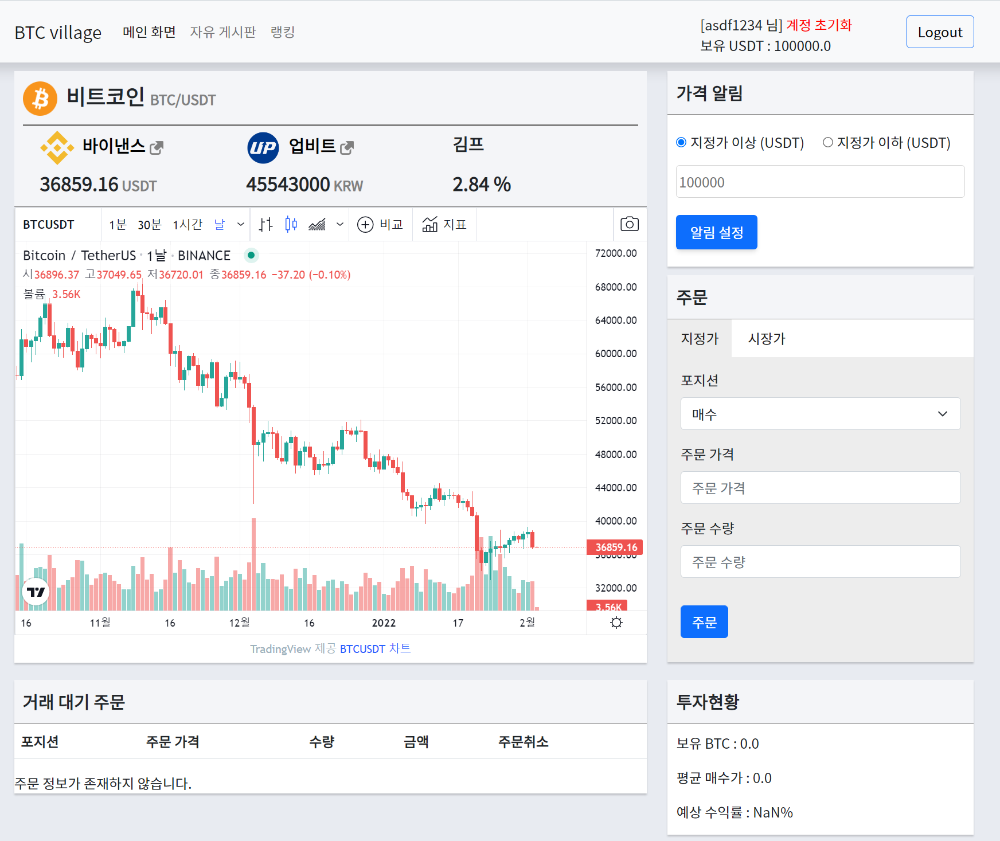

# BTC village 모의 가상화폐 거래소

 

## 목표

- 모의로 가상화폐 거래소를 만들어 API를 통해 실제 BTC 차트를 가져와 출력하고, 지정한 가격에 도달 시 알림기능, 보유한 USDT로 모의투자가 가능한 웹 페이지를 만들고 배포한다.

## 설명

- 사용 언어 : Python(3.9.7)
- 사용 프레임워크
  - django(4.0.1)
  - Bootstrap(3.3.2)
- 사용 에디터 : Visual Studio Code(1.63.2)

## BTC Village URL
- [BTC Village](http://btc-village.com/)