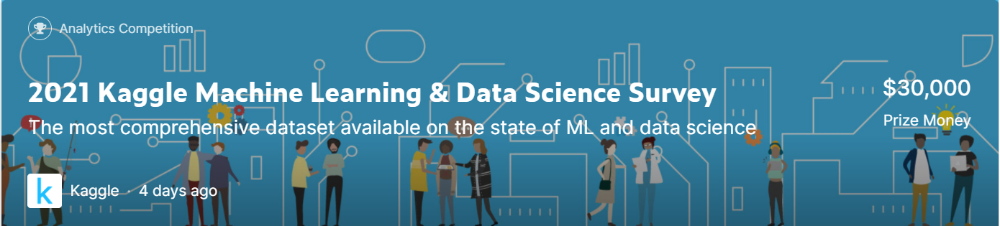

# 2021 캐글 머신러닝 & 데이터 사이언스 대회

 

## 목표 

---
 - 2019, 2021 캐글러의 설문조사 데이터를 받아와 주제를 선정해 데이터 과학 및 머신러닝 실무자의 영향,우선순위 또는 관심사를 심층적으로 탐구한다.

## 설명

---
- 사용언어 : Python
- 사용 라이브러리 : Pandas, Numpy, plotly
- 사용 툴 : Kaggle Notebook, Google Colaboratory

## 데이터

---

 아래의 페이지에서 Download All 을 클릭하면 다운로드가 가능하다.

 - [2019년 데이터 다운로드 페이지](https://www.kaggle.com/c/kaggle-survey-2019/data)
 - [2021년 데이터 다운로드 페이지](https://www.kaggle.com/c/kaggle-survey-2021/data)

## Notebook URL

---

## [The latest trends in East Asia, Japan and China](https://www.kaggle.com/kwdoku145/the-latest-trends-in-east-asia-japan-and-china)

